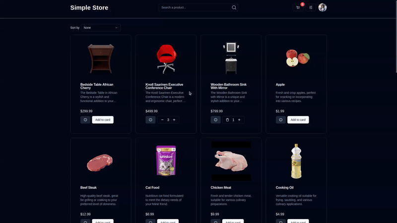
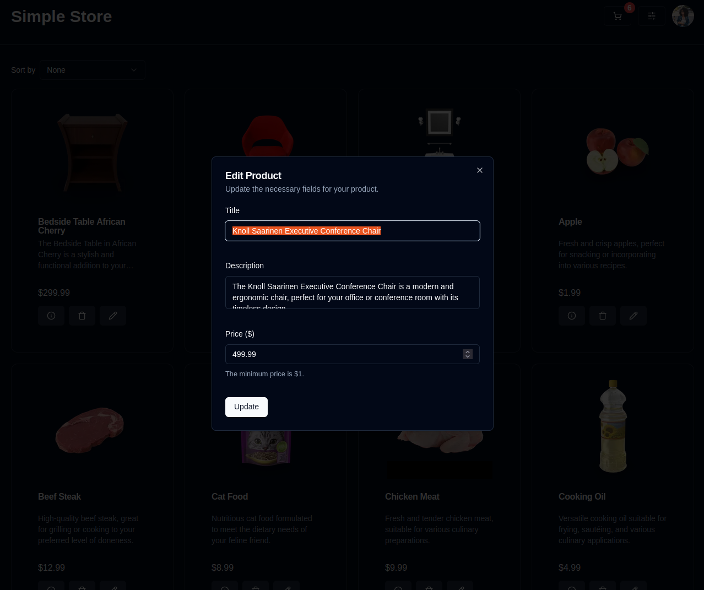
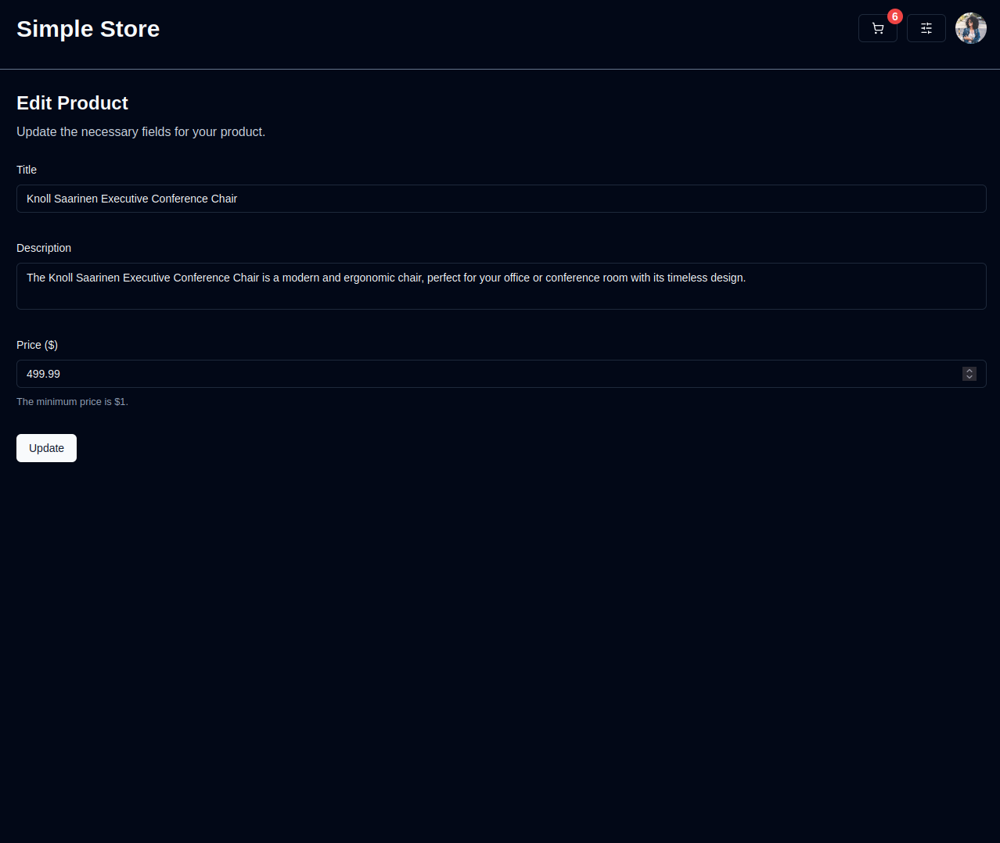
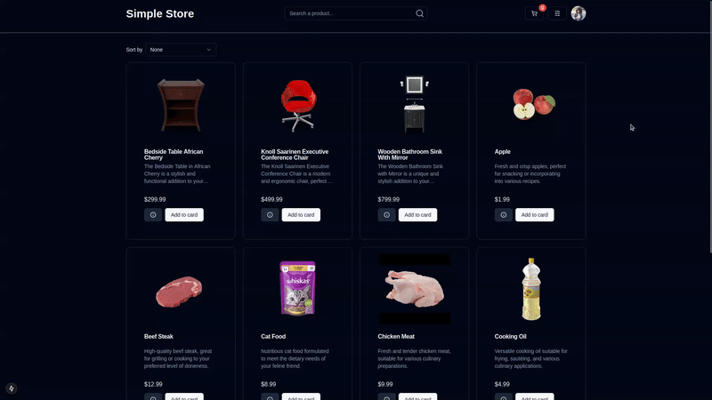

# Simple E-commerce CRUD Application

## About the project

<a href="https://simple-ecommerce-crud.vercel.app">
  <div style="text-align: center;">
    
  </div>
</a>

This project is a [**Simple E-Commerce Application**](https://simple-ecommerce-crud.vercel.app) that includes essential features such as a shopping cart and CRUD (Create, Read, Update, Delete) operations for managing products. Users can browse through a list of products, add items to their cart, and proceed to checkout. The application also allows administrators to manage the product inventory efficiently.

## Built with

- [Next.js](https://nextjs.org/)
- [React Query](https://tanstack.com/query/latest)
- [React.js](https://react.dev/)
- [Tailwind CSS](https://tailwindcss.com/)
- [Shadcn UI](https://ui.shadcn.com/)
- [Zustand](https://github.com/pmndrs/zustand)
- [React Hook Form](https://www.react-hook-form.com/)
- [Zod](https://zod.dev/)

## Features

- [Server Side Rendering (SSR)](#server-side-rendering-ssr)
- [Intercepting Routes](#intercepting-routes)
- [Global State Management (Cart)](#global-state-management-cart)
- [Clean API integration with React Query hooks](#clean-api-integration-with-react-query-hooks)
- [Infinite Loading on Products List](#infinite-loading-on-products-list)

## Server Side Rendering (SSR)

Server-Side Rendering (SSR) in Next.js generates some of the HTML on the server for each request. Instead of sending an empty page to the browser, Next.js pre-renders certain components of the page with data, sending less JavaScript to the client-side.

In the Product Details Page, the API Request to fetch the product data is made on the server, then it sends the rendered html with the content to the client-side:

```tsx
/*
- This is a React Server Component, if the product is found, the html is rendered. Otherwise, the notFound page is returned.
*/
export default async function ProductDetailsPage({ params }: Props) {
  const { id } = await params;

  try {
    const product = await getProductById(Number(id));

    if (!product) return notFound();

    return <ProductDetailsContent product={product} />;
  } catch (_error) {
    return notFound();
  }
}
```

## Intercepting Routes

Next.js Intercepting Routes is a powerful feature that allows you to load a route in the current layout without fully navigating away from the current page. This is particularly useful for creating modal-like experiences or contextual overlays.

For example, in this project, clicking on the edit product button will open a form modal instead of redirecting to a new page, while still updating the URL:

<div style="text-align: center;">
  
</div>

However, if you refresh or navigate directly to the specified route, it will return the expected full page:

<div style="text-align: center;">
  
</div>

## Global State Management (Cart)

Global state management in React application allows you to share and manage data across multiple components without passing props manually.

In this project, we need this to handle the shopping cart logic. So we use [Zustand](https://github.com/pmndrs/zustand) for state management, which provides a simple and scalable solution, while avoiding unnecessary re-renders.

The shopping cart state is managed globally to ensure that the cart's contents are accessible from any part of the application. This allows users to add products to the cart from different pages and view the cart's contents seamlessly.

Here is how the Cart Store is structured:

```tsx
// ...
import { create } from "zustand";

interface CartState {
  products: CartProductType[];
  addProduct: (product: ProductType) => void;
}

export const useCartStore = create<CartState>((set) => ({
  /*
  - The `getPersistentStorageItem` function uses LocalStorage to persist data storage on a user's device
  */
  products: getPersistentStorageItem(PersistentStorageKeys.CART_PRODUCTS) || [],
  addProduct: (product) =>
    set((state) => {
      // ...
    }),

  // ...
}));
```

And to manage the state in our application, We can use the `useCartStore` hook:

```tsx
const { addProduct, products } = useCartStore((state) => state);
```

## Clean API integration with React Query hooks

React Query is a powerful library for managing server-state in React applications. It simplifies data fetching, caching, synchronization, and updating, providing a set of hooks to handle these operations efficiently.

### `useQuery`

The `useQuery` hook is used to handle data fetching and caching from API Requests:

```ts
/*
- Custom Hook that wraps the useQuery and manages the product data efficiently.
*/
export function useProductsById(id: number) {
  return useQuery<ProductType>({
    queryKey: [QueryKeys.PRODUCTS, id],
    queryFn: async () => {
      const data = await getProductById(id);

      return data;
    },
  });
}
```

The React Query also supports integration with SSR:

```ts
// @/app/products/[id]/edit/page.tsx

/*
- This is a React Server Component that prefetches the product data and returns to the client-side
*/
export default async function UpdateProductPage({ params }: Props) {
  const { id } = await params;

  const queryClient = new QueryClient();

  await queryClient.prefetchQuery({
    queryKey: [QueryKeys.PRODUCTS, Number(id)],
    queryFn: async () => {
      const response = await getProductById(Number(id));

      return response;
    },
  });

  return (
    <HydrationBoundary state={dehydrate(queryClient)}>
      {/* ... */}
    </HydrationBoundary>
  );
}
```

### `useMutation`

The `useMutation` hook is used to handle API Requests that modify server data:

```tsx
// @/service/products/mutations.ts

/*
- Custom Hook that wraps the useMutation and to handle the update of certain product data.
*/
export const useUpdateProductMutation = (
  id: number,
  mutationOptions: // ...
) => {
  return useMutation<ProductType, AxiosError<string>, CreateProductPayloadType>(
    {
      mutationFn: (updatedProduct) => {
        return updateProduct(id, updatedProduct);
      },
      ...mutationOptions,
    }
  );
};

// @/components/view/update-product/index.tsx

/*
- Implementation of the hook, validating the success and error scenarios.
*/
const { mutate: updateProduct, isPending } = useUpdateProductMutation(
  Number(id),
  {
    onSuccess: () => {
      // ...
    },
    onError: () => {
      // ...
    },
  }
);
```

## Infinite Loading on Products List

Infinite loading is a design pattern used in web applications where additional content is loaded automatically as the user scrolls down the page. This creates a seamless experience by continuously fetching and displaying more data without requiring the user to manually navigate to the next page.

On the Home Page of the application, infinite loading is used for the Products List

<div style="text-align: center;">
  
</div>

And this feature is implemented with the `useInfiniteQuery` React Query Hook and with the Intersection Observer API

```tsx
// @/service/products/queries.ts

/*
- Custom Hook that wraps the useInfiniteQuery and manages the data coming from the product list API endpoint.
*/
export function useProducts(
  params?: UseProductParamsType,
  queryOptions?: // ...
) {
  return useInfiniteQuery({
    queryFn: async ({ pageParam = 1 }) => {
      // ...
    },
    // ...
    ...queryOptions,
  });
}

// @/components/products/list/index.tsx

export function ProductsList() {
  // ...

  const {
    data: products,
    isFetchingNextPage,
    hasNextPage,
    fetchNextPage,
    isFetching,
    isLoading: isQueryLoading,
  } = useProducts({ sortBy: selectedSortBy, search: productsSearch });
  const observer = useRef<IntersectionObserver>();
  const isLoading = isFetchingNextPage || isFetching;

  /*
  - The IntersectionObserver observes for when the last Product Item Element intersects the viewport, then the `fetchNextPage` function is called
  */
  const lastElementRef = useCallback(
    (node: HTMLDivElement) => {
      if (isLoading) return;

      if (observer.current) observer.current.disconnect();

      observer.current = new IntersectionObserver((entries) => {
        if (entries[0].isIntersecting && hasNextPage && !isFetching) {
          fetchNextPage();
        }
      });

      if (node) observer.current.observe(node);
    },
    [fetchNextPage, hasNextPage, isFetching, isLoading]
  );

  // ...
}

```

## Installation

To get started with this project, follow these steps:

1. **Clone the repository:**

```bash
git clone https://github.com/angelomarques/simple-ecommerce-crud.git
cd simple-ecommerce-crud
```

2. **Install dependencies:**

```bash
npm install
# or
yarn install
# or
pnpm install
# or
bun install
```

3. **Set up environment variables:**

Create a `.env.local` file in the root directory and add the necessary environment variables. Refer to `.env.example` for the required variables.

4. **Run the development server:**

```bash
npm run dev
# or
yarn dev
# or
pnpm dev
# or
bun dev
```

5. **Open the application:**

Open [http://localhost:3000](http://localhost:3000) with your browser to see the result.
